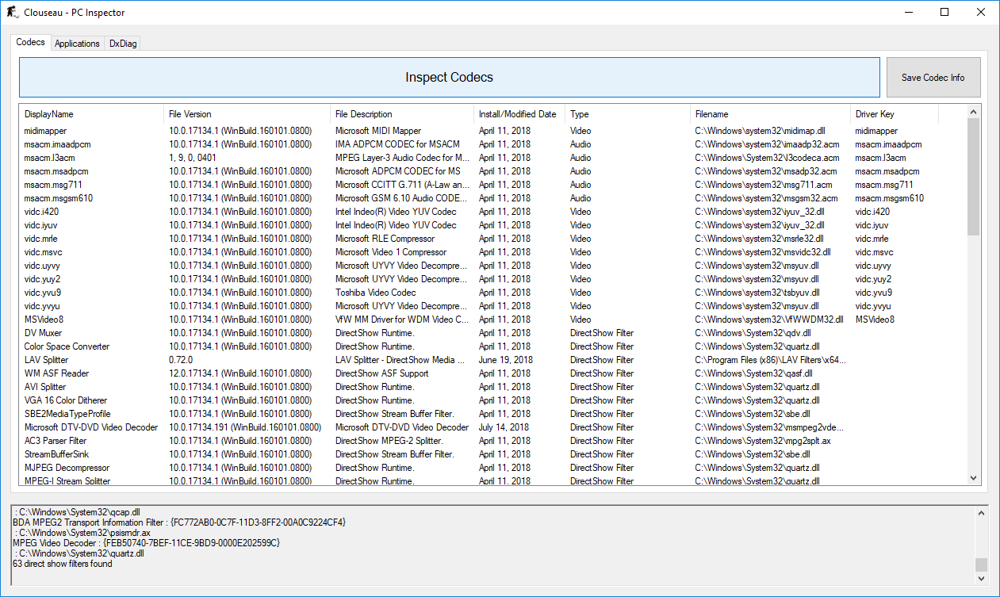
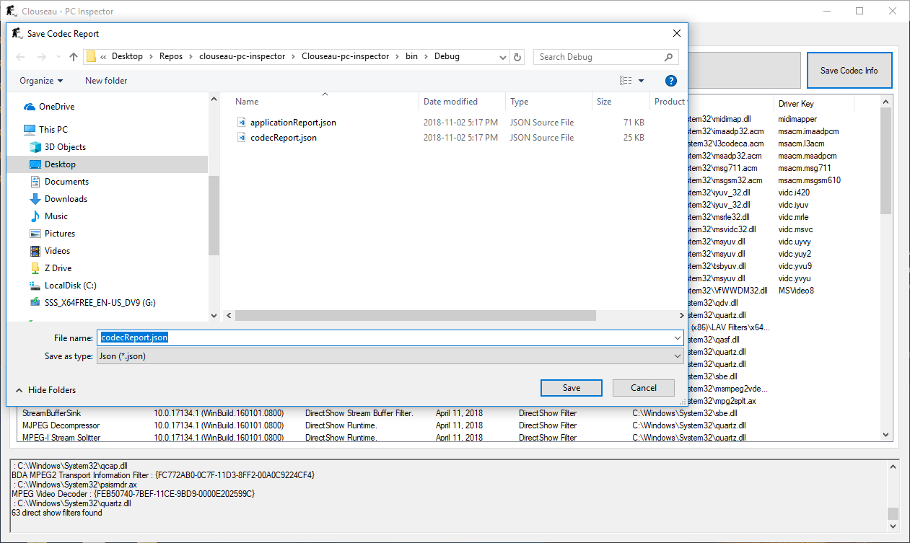
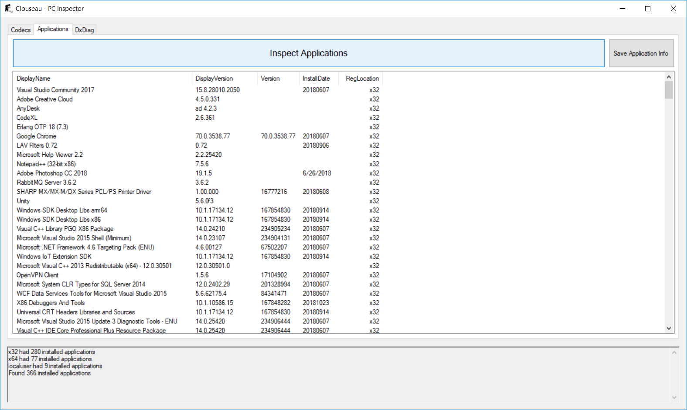
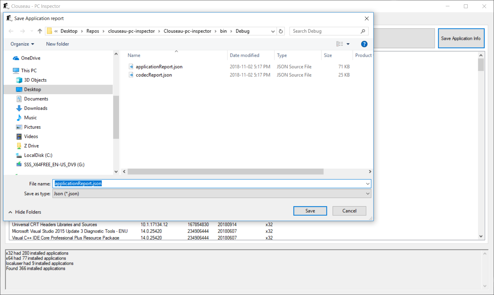
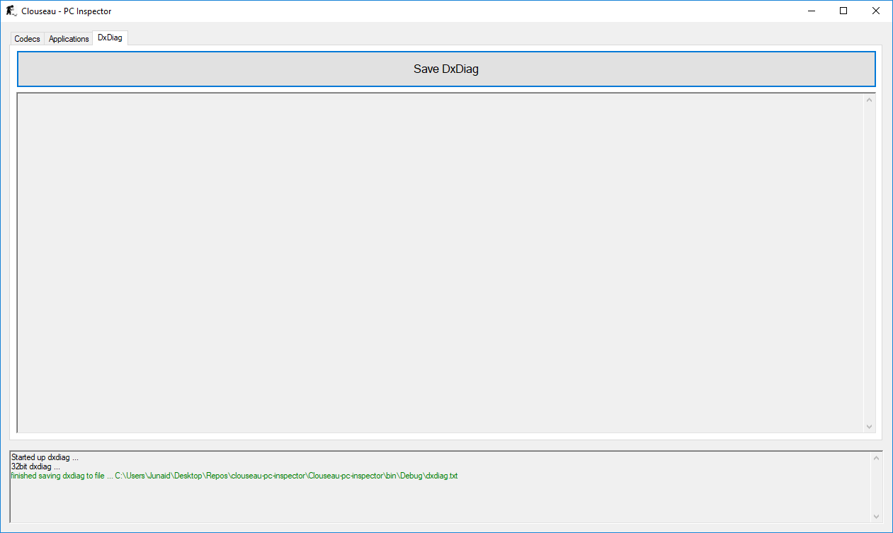

# Clouseau PC Inspector

### Summary
Clouseau is built to give a quick and easy way to show you what is installed on your computer and a give you a way to save that data. Below is a quick rundown of the info Clouseau can show you.

  - DirectShow codecs 
  - Audio Drives
  - Video Drivers
  - Applications
  - DxDiag

### Codec & Driver Info
Codec and driver information is gathered from the following regisrty locations

Codec drivers list from
```
HKEY_LOCAL_MACHINE\SOFTWARE\Microsoft\Windows NT\CurrentVersion\Drivers32
```
DirectShow filters list from
```
HKEY_CLASSES_ROOT\CLSID\{083863F1-70DE-11d0-BD40-00A0C911CE86}\Instance
```



You can then choose to save the codec drivers and driectshow filters list to a json file



### Application Info
Application info is gathered from the following registry locations

x32 & x64
```
HKEY_LOCAL_MACHINE\\SOFTWARE\\Microsoft\\Windows\\CurrentVersion\\Uninstall
```

localuser
```
HKEY_CURRENT_USER\\SOFTWARE\\Microsoft\\Windows\\CurrentVersion\\Uninstall
```



You can then choose to save the 32bit, 64bit and localuser applications list to a json file



### DxDiag
Clicking the Save DxDiag button in the dxdiag tab will prompt you save the dxdiag at a location. Clouseau will then run dxdiag in the background and generate a dxdiag file and notify you with the in app log as to when the file is finished creating it.


### Tech
Clouseau uses a number of open source projects to work properly, these are also available as nuget packages:

* [Fody] - Extensible tool for weaving .net assemblies
* [Costura] - Embeds dependencies as resources
* [Json.NET] - Popular high-performance JSON framework for .NET

And of course Clouseau itself is open source 

### Installation

Clousea is built as a portable application and does not require any installation


### Todos

 - Show generated dxdiag in the window
 - Add About tab 

License
----
MIT


[Fody]:<https://github.com/Fody/Fody/>
[Costura]:<https://github.com/Fody/Costura>
[Json.NET]:<https://www.newtonsoft.com/json>


